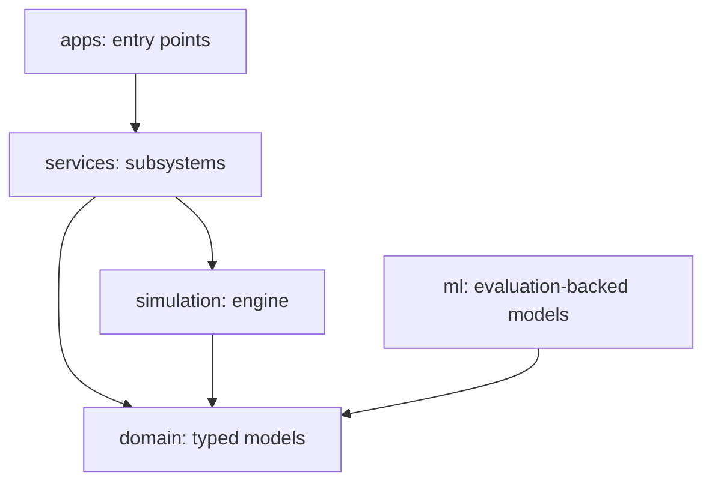
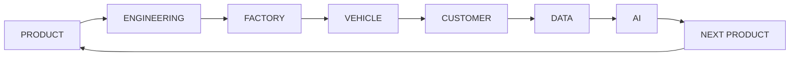

# Architecture

AutoForge is a **modular monolith**: one deployable, layered Python package,
not microservices. Microservices would add distribution, consistency, and
deployment cost that a single-process simulator does not need. The layering
keeps modules independently testable while the shared simulation engine keeps
them consistent in time.

## Layers

- **domain/** — frozen Pydantic models describing company, vehicles, battery
  packs, motors, and later factories, fleets, markets. No behavior, only
  validated structure and explicit units.
- **simulation/** — the engine: clock (days), seeded RNG, discrete-event queue,
  subsystem protocol, structured logging, and run records.
- **services/** — subsystems that implement `step(ctx, dt_days)` and emit
  structured events. `services/vehicle/powertrain.py` is implemented
  (longitudinal force, energy, SOC, regen, power limiting); BMS, ADAS, factory,
  fleet, market, and finance land in later phases.
- **apps/** — runnable entry points: the headless simulation app today, a
  FastAPI backend and web dashboard later.
- **ml/** — only ML modules that have been evaluated on data; classical methods
  are preferred where they are better.

Dependencies point inward: apps -> services -> simulation/domain. Services
never import apps; subsystems never reach into the engine internals.

## The core loop

Each phase of the loop is a subsystem; events and telemetry travel through the
shared structured log so the loop can be traced end to end.

## Reproducibility contract

A run is defined by `(seed, config, autoforge_version)`. The engine:

- advances a single `SimulationClock` in fixed day steps (partial final step
  to hit an exact horizon);
- draws all randomness from one seeded `random.Random` stream;
- schedules discrete events on a min-heap with stable (time, insertion) order;
- writes every emitted event to a `StructuredLog` (in memory, optionally
  JSONL) tagged with simulation time, run id, and subsystem;
- records seed, config, version, timestamps, step count, and results on the
  `SimulationRun`.

Same inputs therefore reproduce the same run id and event log. Trade-offs:

- **Single RNG stream.** A subsystem's draws depend on the draw order of other
  subsystems. Simple and fine now; per-subsystem streams are a documented
  future improvement for isolation.
- **Days as base unit.** Physics modules convert to SI seconds internally;
  field names carry explicit unit suffixes (e.g. `_m2`, `_kwh`, `_kg`) so there
  is never ambiguity. The powertrain steps the engine at the scenario timestep
  (`dt_days = timestep_s / 86400`) and consumes one scenario interval per tick;
  it is fully deterministic, so identical (vehicle, scenario, config, version)
  reproduce the identical `SimulationResult` regardless of seed.

## EV powertrain

The powertrain is the first physics subsystem. A validated `DrivingScenario`
(time/speed/grade samples) feeds `PowertrainSubsystem`, which per interval
computes longitudinal force (aerodynamic drag, rolling resistance, grade,
inertia), converts wheel power through fixed motor/drivetrain efficiencies,
applies battery C-rate and SOC limits, and tracks energy consumed/recovered,
power limiting, and depletion. Regen energy is never created: any recoverable
energy that cannot be stored (full SOC, C-rate, power, SOC-floor limits) is
discarded and counted in `regen_discarded_kwh`. Results are returned as a typed
`SimulationResult` (trajectory + `ResultSummary`) and mirrored onto the
`SimulationRun`. Equations, assumptions, and hand-derived reference values live
in [docs/powertrain.md](autoforge/docs/powertrain.md).

## Units and validation

- Domain models are **frozen** and validated at construction; nonsense
  configurations (reversed voltage bounds, continuous power above peak,
  negative mass) fail fast.
- SI preferred; industry-conventional units (km, kWh) allowed where the field
  name states the unit.
- No secrets are ever committed; runtime configuration lives in `.env` (see
  `.env.example`) and run configuration in `autoforge/configs/`.

## Evolution path

1. **Phase 3-4 (done)**: vehicle designer model layer + EV powertrain as the
   first real physics subsystem, exercising the engine end to end.
2. **Phase 5-6**: BMS and smart factory — BMS deepens the powertrain model,
   the factory starts the production side of the loop.
3. **apps/web**: React dashboard on top of the FastAPI app; the dashboard only
   reads what the simulation actually produces.
4. Microservices, ROS2, CARLA, MQTT/Kafka, Redis, CUDA, or cloud services will
   only be added when a concrete requirement justifies them — not for prestige.

## Safety boundary

AutoForge simulates software and never controls hardware. ADAS, BMS, robotics,
and any ML modules are experimental simulation models and must not be
represented as safety-critical production software. See [SECURITY.md](SECURITY.md).
