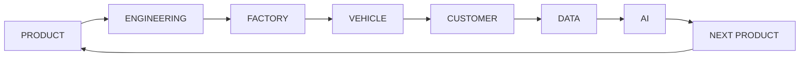

# AutoForge

Open-source, AI-native **automobile company simulator** — a simulation of an
interconnected car company, not a collection of unrelated demos.

> **Educational / research software only.** AutoForge is a simulation. It must
> never be presented as software for real vehicles, factories, robots, or other
> safety-critical control, and none of its modules can or should control real
> actuators.

## Core loop



The loop is the backbone of the simulator: products are engineered, built,
sold, measured through telemetry, and the data drives the next product. Every
module plugs into this loop instead of living in isolation.

## What exists today

This is **milestone 0** (foundation). Working and tested:

- **Domain models** — `Company`, `VehicleModel`, `VehicleVariant`, `BatteryPack`,
  `Motor` as typed, validated, immutable Pydantic models with explicit units.
- **Simulation engine** — a clock in days, seeded deterministic randomness, a
  discrete-event queue, a subsystem protocol, structured event logging, and a
  `SimulationRun` record that captures seed, config, version, timestamps, and
  results for reproducibility.

Everything else on the roadmap below is planned, not built. Nothing here makes
claims about real vehicles or markets.

## Repository layout

```
autoforge/
├── apps/          # entry points: web frontend (later), simulation backend
├── domain/        # typed domain models (company, vehicle, battery, motor, ...)
├── services/      # service layer (powertrain, ADAS, factory, fleet, ...) [later]
├── simulation/    # engine foundation: clock, RNG, events, engine, logging
├── ml/            # ML modules, only where justified [later]
├── data/          # data loaders and generated datasets [later]
├── tests/         # pytest suite
├── docs/          # design documentation and roadmap
├── scripts/       # CLI entry points
└── configs/       # reference run configurations
```

## Setup

Requires Python 3.11+ (3.12+ recommended).

```bash
python3 -m venv .venv && source .venv/bin/activate
pip install -e ".[dev]"
```

The repository is developed against a system Python 3.11 in CI containers;
installations elsewhere should prefer a virtual environment.

## Running the foundation demo

```bash
python -m autoforge.scripts.demo_foundation --seed 42 --days 30
```

The demo creates a company and a vehicle variant, runs a month of simulated
time with a scheduled mid-run event, and prints the run record and event log.
Same seed reproduces the same run id and event log.

## Testing, linting, type checking

```bash
make test      # pytest
make lint      # ruff check
make format    # ruff format
make typecheck # mypy
make check     # everything
```

## Roadmap

See [docs/roadmap.md](autoforge/docs/roadmap.md) for the phase-by-phase plan.
Implemented phases are marked; the simulator is currently at **Phase 2**
(domain models + simulation foundation).

## Assumptions and limitations

- Simulation time advances in fixed day steps; fast dynamics (powertrain,
  ADAS) convert to SI seconds internally when they arrive.
- Randomness comes from a single seeded stream per run; identical seed +
  config + version reproduces identical results. Per-subsystem streams are a
  deliberate future improvement for debugging isolation.
- Market, finance, ML, and AI modules will be **explicitly simulated** — they
  make no real-world forecasting claims.

## License

MIT — see [LICENSE](LICENSE). See [NOTICE](NOTICE) for third-party notices.
