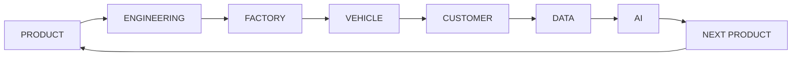

# AutoForge

Open-source, AI-native **automobile company simulator** — a simulation of an
interconnected car company, not a collection of unrelated demos.

> **Educational / research software only.** AutoForge is a simulation. It must
> never be presented as software for real vehicles, factories, robots, or other
> safety-critical control, and none of its modules can or should control real
> actuators.

## Core loop



The loop is the backbone of the simulator: products are engineered, built,
sold, measured through telemetry, and the data drives the next product. Every
module plugs into this loop instead of living in isolation.

## What exists today

This is **milestone 3** (foundation + vehicle physics + production). Working
and tested:

- **Domain models** — `Company`, `VehicleModel`, `VehicleVariant`, `BatteryPack`,
  `Motor` as typed, validated, immutable Pydantic models with explicit units.
- **Simulation engine** — a clock in days, seeded deterministic randomness, a
  discrete-event queue, a subsystem protocol, structured event logging, and a
  `SimulationRun` record that captures seed, config, version, timestamps, and
  results for reproducibility.
- **Driving scenarios** — validated time/speed/grade profiles
  (`DrivingScenario`) plus builders for constant-speed and a documented
  reference highway cycle.
- **EV powertrain** — `PowertrainSubsystem`/`PowertrainSimulator` with a
  `PowertrainConfig`: longitudinal force, motor/drivetrain/regen efficiencies,
  auxiliary load, battery C-rate limits, SOC floors, regen accounting, energy
  conservation, power limiting, and battery depletion events. Deterministic
  (no randomness) and reproducible per (vehicle, scenario, config, version).
- **Battery / BMS** — `BatterySimulator` runs the BMS-style view over any
  powertrain result: linear-OCV current/voltage with an IR drop, lumped I²R
  heating with Newton cooling, energy-throughput SOH degradation, and
  deterministic threshold faults. The powertrain stays authoritative for
  SOC/energy; the battery SOC is a consistency check.
- **Smart factory** — `FactorySimulator` runs production orders through a
  configured line (RAW -> BATTERY -> BODY -> PAINT -> POWERTRAIN ->
  FINAL_ASSEMBLY -> QC) as discrete items with per-station capacity, cycle
  time, seeded defects and downtime, material consumption/shortages, and
  PASS/REWORK/FAIL quality inspections. Bottleneck is derived from utilization
  metrics, and vehicles that pass QC become `FinishedVehicle`s with a cost
  tally (variable + rework + scrap).
- **Connected fleet** — `FleetSimulator` takes the factory's `FinishedVehicle`s
  and operates them day by day against a scenario, replaying the powertrain and
  battery simulators per drive. It samples battery telemetry at a configurable
  interval, carries SOC/SOH between days, and schedules maintenance from
  battery faults or low SOH. Outputs are typed `FleetAnalytics` with
  availability, distance/energy, fault counts, and per-vehicle operations.

Everything else on the roadmap below is planned, not built. The powertrain,
battery, factory, and fleet are `SIMPLIFIED MODEL`s — constant efficiencies, no
electrochemical cell physics, no calendar aging, no shift calendars or supply
chains, no charging model or real telemetry uplink — and nothing here makes
claims about real vehicles, factories, or markets.

## Repository layout

```
autoforge/
├── apps/          # entry points: web frontend (later), simulation backend
├── domain/        # typed domain models (company, vehicle, battery, motor, scenario, factory, fleet)
├── services/      # service layer (powertrain, battery, factory, fleet; ADAS later)
├── simulation/    # engine foundation: clock, RNG, events, engine, logging
├── ml/            # ML modules, only where justified [later]
├── data/          # scenario builders and reference cycles
├── tests/         # pytest suite
├── docs/          # design documentation and roadmap
├── scripts/       # CLI entry points
└── configs/       # reference run configurations
```

## Setup

Requires Python 3.11+ (3.12+ recommended).

```bash
python3 -m venv .venv && source .venv/bin/activate
pip install -e ".[dev]"
```

The repository is developed against a system Python 3.11 in CI containers;
installations elsewhere should prefer a virtual environment.

## Running the foundation demo

```bash
python -m autoforge.scripts.demo_foundation --seed 42 --days 30
```

The demo creates a company and a vehicle variant, runs a month of simulated
time with a scheduled mid-run event, and prints the run record and event log.
Same seed reproduces the same run id and event log.

## Running the powertrain demo

```bash
python -m autoforge.scripts.demo_powertrain
```

The demo simulates the demo vehicle over the documented reference highway
cycle (10 min at 108 km/h) and prints energy consumed/recovered, consumption
per km, estimated range, peak battery power, and final SOC. The expected
values are derived by hand in [docs/powertrain.md](autoforge/docs/powertrain.md).

## Running the battery demo

```bash
python -m autoforge.scripts.demo_battery [--show-trajectory]
```

The demo runs the powertrain over the same reference cycle and then adds the
battery view: pack current/voltage, temperature rise, SOH, throughput,
equivalent full cycles, fault counts, and the SOC consistency check against
the powertrain. Equations and the hand-derived reference values are in
[docs/battery.md](autoforge/docs/battery.md).

## Running the factory demo

```bash
python -m autoforge.scripts.demo_factory [--days 12] [--quantity 30] [--enable-defects]
```

The demo releases a single order for the Aurora onto the default line and
prints finished vehicles, scrap/rework, the utilization-derived bottleneck,
cost, and per-station metrics. `--enable-defects` adds seeded paint defects and
battery downtime to show the stochastic side (still reproducible per seed).
Reference values are derived by hand in
[docs/factory.md](autoforge/docs/factory.md).

## Running the fleet demo

```bash
python -m autoforge.scripts.demo_fleet [--seed 0] [--days 5] [--vehicles 3]
```

The demo builds a few vehicles in the factory, puts them in a fleet, operates
them against the reference highway cycle, and prints fleet analytics
(availability, distance/energy, consumption, telemetry point count, faults,
maintenance, SOH). Reference values are derived by hand in
[docs/fleet.md](autoforge/docs/fleet.md).

## Example vehicle and simulation

`autoforge.apps.simulation.demo.build_demo_variant()` returns the example
"Long Range" variant of the Aurora model:

| Parameter | Value |
| --- | --- |
| Segment / mass | Sedan, 1900 kg kerb |
| Dimensions | 4.90 x 1.88 x 1.45 m, 2.30 m2 frontal, Cd 0.23 |
| Battery | NMC, 77 kWh nominal, 75 kWh usable, 400 V |
| Motor | 230 kW peak / 150 kW continuous |
| Targets | 550 km range, 0-100 km/h in 5.9 s |

Simulate it programmatically:

```python
from autoforge.apps.simulation.demo import build_demo_variant
from autoforge.data.scenarios import reference_highway_cycle
from autoforge.services.battery.model import BatterySimulator
from autoforge.services.vehicle.powertrain import PowertrainSimulator

variant = build_demo_variant()
powertrain = PowertrainSimulator(
    variant=variant,
    scenario=reference_highway_cycle(),
    seed=0,
).simulate()
battery = BatterySimulator(variant).simulate(powertrain)

print(powertrain.result.summary)  # typed SimulationResult summary
print(battery.summary)  # BatterySummary: SOH, temperature, faults, soc error
print(powertrain.run)  # SimulationRun: seed, config, version
```

The same inputs always give the same result: the powertrain and battery draw
no randomness, so the run id and the physics both reproduce exactly.

## Testing, linting, type checking

```bash
make test      # pytest
make lint      # ruff check
make format    # ruff format
make typecheck # mypy
make check     # everything
```

## Roadmap

See [docs/roadmap.md](autoforge/docs/roadmap.md) for the phase-by-phase plan.
Implemented phases are marked; the simulator is currently at **Phase 6**
(domain models + simulation foundation + EV powertrain + battery/BMS + smart
factory).

## Assumptions and limitations

- Simulation time advances in fixed day steps; fast dynamics (powertrain)
  convert to SI seconds internally and the engine steps at the scenario
  timestep.
- Randomness comes from a single seeded stream per run; identical seed +
  config + version reproduces identical results. The powertrain is fully
  deterministic — only its run id depends on the seed.
- The powertrain is a `SIMPLIFIED MODEL`: constant motor/drivetrain/regen
  efficiencies, constant auxiliary load, no thermal/HVAC, no cell imbalance,
  no internal battery losses. Estimated range is a simple division, not a
  certification or real-world figure. See
  [docs/powertrain.md](autoforge/docs/powertrain.md).
- The battery is a `SIMPLIFIED MODEL`: linear OCV, constant pack resistance,
  lumped single-node thermal mass, linear energy-throughput SOH degradation
  (no calendar aging, no temperature/aging coupling), and threshold faults on
  aggregate pack quantities. See [docs/battery.md](autoforge/docs/battery.md).
- The factory is a `SIMPLIFIED MODEL`: one-day time slicing, no shift
  calendars or setups, scalar station capacity, FIFO queues with no WIP
  limits, constant seeded defect/downtime rates (no real quality data), and a
  cost tally limited to variable + rework + scrap. See
  [docs/factory.md](autoforge/docs/factory.md).
- Market, finance, ML, and AI modules will be **explicitly simulated** — they
  make no real-world forecasting claims.

## License

Apache License 2.0 — see [LICENSE](LICENSE). Original AutoForge code is
licensed under Apache-2.0. See [NOTICE](NOTICE) for third-party notices;
third-party libraries keep their own licenses.
